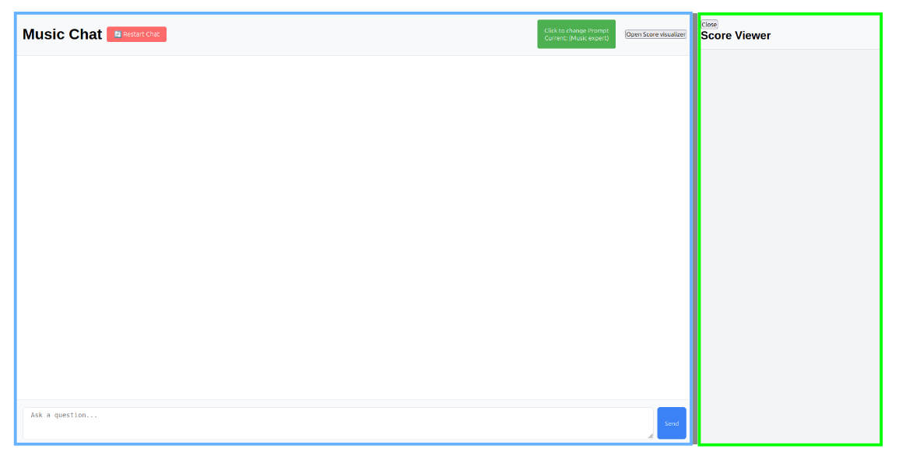
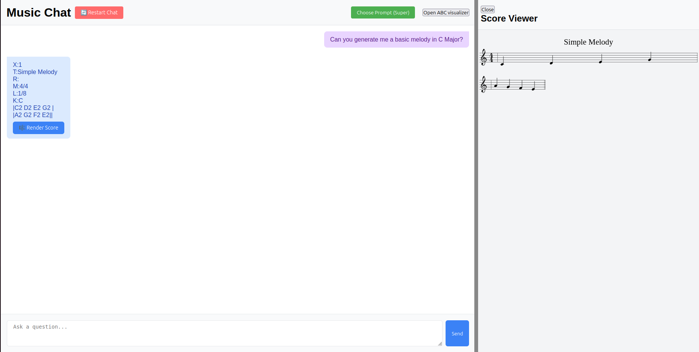

# 🎼 TFG: Unified Music Framework & Web Demo

This repository contains the main components developed for my Final Degree Project (TFG), focused on musical data processing, transformation, and user interaction through language models. The project is divided into two parts:

- [`CHAT_UNIFICAT/`](#-chat_unificat-musical-framework): An interactive chat-based musical framework powered by LLaMA 3.1 via LangChain.
- [`WEB_DEMO/`](#-web_demo-xml-to-abc-conversion-demo): A lightweight web demo that converts MusicXML to ABC notation, along with visual materials used for presentation and documentation.

---

## 📁 Repository Structure

- `CHAT_UNIFICAT/` – Main application: Musical chat framework  
- `WEB_DEMO/` – Web-based demo for XML ➜ ABC conversion  
- `screenshots/` – Screenshots used in the documentation  
- `LICENSE` – Project license (MIT)  
- `README.md` – This file

---

## 🎵 `CHAT_UNIFICAT/`: Musical Framework

**Musical Framework** is an interactive chat application that integrates the **LLaMA 3.1** model via **LangChain**, designed to offer a tailored experience in the musical domain. It includes three predefined modes:

- 🎧 **Music Expert** – responds as a music expert; ideal for music theory, composition, or genre-related questions.  
- ✍️ **Lyrics Expert** – helps write or edit song lyrics.  
- ✨ **Empty** – a flexible, prompt-free mode intended for custom instructions. This mode allows users to define their own musical context (e.g., arranging, chord analysis, score interpretation, instrument advice) and interact freely with the model without preconditioning.

---

### ⚙️ Technologies Used

- Python 3.12.3  
- Flask  
- JavaScript / HTML  
- LangChain  
- Ollama (LLaMA 3.1 running locally)

---

### 🛠️ Installation

1. Clone the repository:

    ```bash
    git clone https://github.com/yourusername/tfg-musical-framework.git
    cd tfg-musical-framework/CHAT_UNIFICAT
    ```

2. Create and activate a virtual environment:

    ```bash
    python -m venv venv
    source venv/bin/activate  # On Windows: venv\Scripts\activate
    ```

3. Install dependencies:

    ```bash
    pip install flask langchain langchain_community
    ```

4. Make sure [Ollama](https://ollama.com/) is installed and running locally with the LLaMA 3.1 model.

---

### Walkthrough

#### 🖥️ 1. Starting Screen

> 

#### 🎧 2. Music Expert Mode  
`Create me a basic melody in C Major.`  
> 

#### ✍️ 3. Lyrics Expert  
`Can you add lyrics to the previous score?`  
> 

#### ✨ 4. Empty Prompt Mode  
Manual testing with ABC prompt.  
> 

---

## 🌐 `WEB_DEMO/`: XML to ABC Conversion Demo

This directory contains a web interface designed to demonstrate a basic transformation pipeline from MusicXML to ABC notation.

### 🧩 Features

- Converts MusicXML files into ABC format
- Provides example files, transformation scripts, and screenshots
- Useful for visualizing and validating music notation conversion workflows

This tool was used to support and visualize part of the project’s methodology and evaluation process.

---

## 👤 Author

- **Martí Vera**


---

## 📄 License

This project is licensed under the [MIT License](LICENSE).
