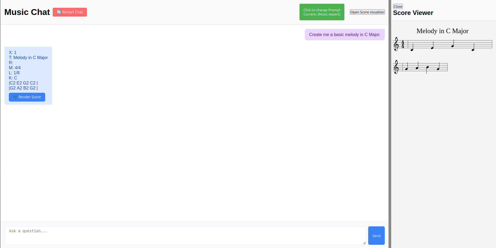

# 🎵 Musical Framework

**Musical Framework** is an interactive chat application that integrates the **LLaMA 3.1** model via **LangChain**, designed to offer a tailored experience in the musical domain. It includes three predefined modes:

- 🎧 **Music Expert**: responds as a music expert — perfect for questions about theory, production, genres, and more.  
- ✍️ **Lyrics Expert**: specialized in helping you write, analyze, or edit song lyrics.  
- ✨ **Empty**: a prompt-free mode that allows users to input their own custom instructions.

---

## ⚙️ Technologies Used

- Python 3.12.3  
- Flask  
- JavaScript  
- HTML  
- LangChain  
- Ollama (LLaMA 3.1 running locally)

---

## 🛠️ Installation

1. Clone the repository:

    ```bash
    git clone https://github.com/yourusername/musical-framework.git
    cd musical-framework
    ```

2. Create and activate a virtual environment:

    ```bash
    python -m venv venv
    source venv/bin/activate  # On Windows: venv\Scripts\activate
    ```

3. Install the required dependencies:

    ```bash
    pip install flask langchain langchain_community
    ```

4. Make sure you have [Ollama](https://ollama.com/) installed and running locally with the LLaMA 3.1 model available.

---

## 💻 Requirements

- Python 3.12.3  
- Visual Studio Code (recommended)  
- Ollama installed and running locally  
- A modern web browser

---

## 👤 Author

- **Marti Vera**

---
## 📸 Screenshots & Walkthrough

Here’s a quick visual overview of how to use **Musical Framework** and its different modes:

---

### 🖥️ 1. Starting Screen

The app begins with two main areas:

- **Left Panel**: Chat interface with buttons for expert selection, restart, and score rendering.
- **Right Panel**: Score viewer that displays generated ABC notation as rendered sheet music.

> 

---

### 🎧 2. Music Expert Mode

Click on **Music Expert** and send:  
`Create me a basic melody in C Major.`

After the response, you will see a **Render Score** button to visualize the ABC notation.

>   
> 

---

### 🎼 3. Requesting a Complex Melody

Try asking:  
`Can you generate a complex melody in F Major?`

> 

---

### ✍️ 4. Lyrics Expert Mode

Switch to **Lyrics Expert** and ask:  
`Can you add lyrics to the previous score you generated for me?`

> 

---

### ✨ 5. Empty Prompt Mode

Select the **Empty** expert and run the same tests manually:

1. `Create me a basic melody in C Major (using ABC notation)`
2. `Can you add lyrics to the previous score you generated for me?`

> 

---

## ✅ Evaluation

Once you’ve completed the walkthrough, you can fill out the evaluation form:

[📝 Feedback Form](https://forms.gle/pH43fw3BTxifmaUVA)

---

> 📁 *Place your screenshots in a folder called `screenshots/` inside your project for the image paths above to work.*


## 📄 License

This project is licensed under the [MIT License](LICENSE).
